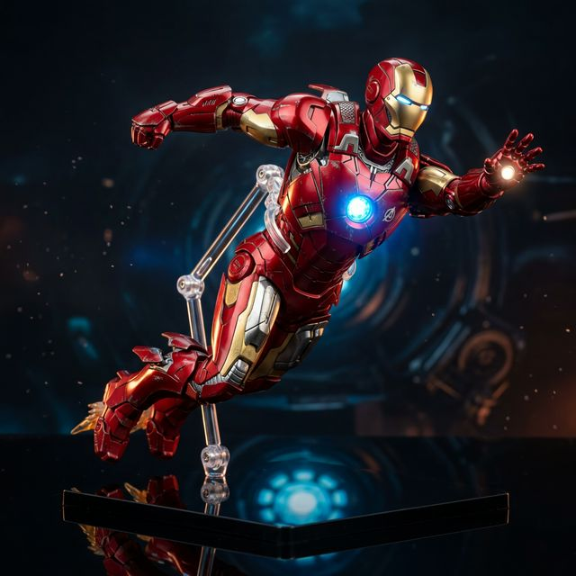
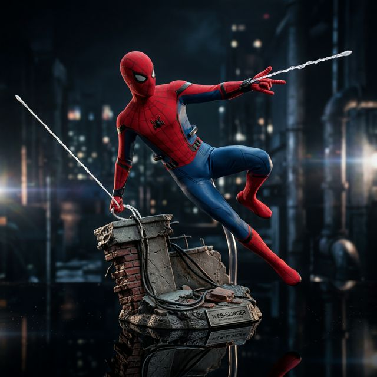
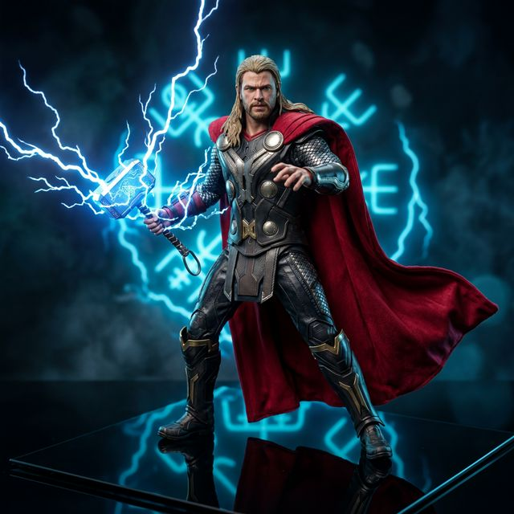
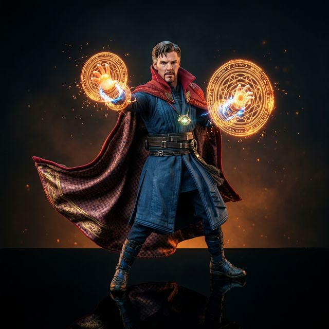
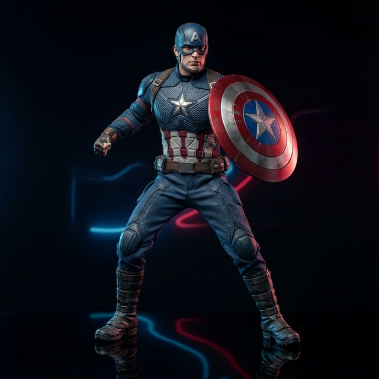

# MarvelVault – Premium Marvel Studios Collectible Figures


A futuristic, premium landing page showcasing high‑end Marvel collectible action figures. The site features a dark, neon‑accented UI, animated particle background, glass‑morphism product cards, and smooth micro‑interactions.

---

## ✨ Features
- **Futuristic Design** – Dark theme with neon red, purple, and blue accents, custom gradients, and animated grid overlay.
- **Animated Particle Background** – Interactive particle network that reacts to mouse movement.
- **Glass‑morphism Product Cards** – Hover lift, glow effects, 3D tilt on mouse move, and dynamic price display.
- **Responsive Layout** – Optimized for desktop, tablet, and mobile devices.
- **Smooth Scroll & Navigation** – Sticky navbar with scroll‑activated link highlighting and a mobile hamburger menu.
- **Counters & Stats** – Animated counters for collectibles, collectors, and MCU characters.
- **Testimonials** – Styled review cards with star ratings.
- **Newsletter CTA** – Email capture form with animated submit button.
- **Fully Static** – No backend required; can be served with any static file server.

---

## 📦 Tech Stack
- **HTML5** – Semantic markup.
- **CSS3** – Custom design system, variables, animations, and responsive grid.
- **JavaScript (ES6)** – Particle system, scroll effects, intersection observers, and UI interactions.
- **Google Fonts** – `Orbitron`, `Rajdhani`, and `Inter` for futuristic typography.
- **Serve** – Simple static server (`npx -y serve .`).

---

## 🚀 Getting Started
### Prerequisites
- **Node.js** (v14+ recommended) – only needed for the `serve` command.

### Installation
```bash
# Clone the repository
git clone https://github.com/kanishknegi2006-oss/antigravity-github-test.git
cd antigravity-github-test
```

### Running Locally
```bash
# Start a static server (no installation needed)
npx -y serve .
```
Open your browser and navigate to the URL shown in the terminal (usually `http://localhost:3000`).

---

## 📸 Screenshots
| Section | Screenshot |
|---|---|
| **Hero** |  |
| **Products** |  |
| **Categories** |  |
| **About** |  |
| **Reviews** |  |
| **Newsletter** |  |

---

## 🛠️ Customisation
- **Design Tokens** – Edit `styles.css` under `:root` to change colors, fonts, radii, and shadows.
- **Products** – Add or remove product cards in the `#products` section of `index.html`. Update images in the `assets/` folder.
- **Particle Background** – Adjust particle count, speed, and colors in `script.js` (look for the `Particle` class).

---

## 📂 Project Structure
```
├─ assets/                 # Image assets for products & hero banner
│   ├─ iron-man.png
│   ├─ spider-man.png
│   ├─ black-panther.png
│   ├─ thor.png
│   ├─ captain-america.png
│   ├─ doctor-strange.png
│   ├─ hulk.png
│   └─ hero-banner.png
├─ index.html              # Main landing page markup
├─ styles.css              # Global stylesheet & design system
├─ script.js               # Interactive JavaScript
├─ README.md               # **You are reading it!**
└─ .gitignore (optional)
```

---

## 🤝 Contributing
Feel free to open issues or submit pull requests for:
- Adding new Marvel characters.
- Enhancing animations or UI effects.
- Improving accessibility.

---

## 📄 License
This project is open‑source and available under the **MIT License**.

---

## 🎉 Demo
Run the local server as described above and explore the full experience at `http://localhost:3000`.
