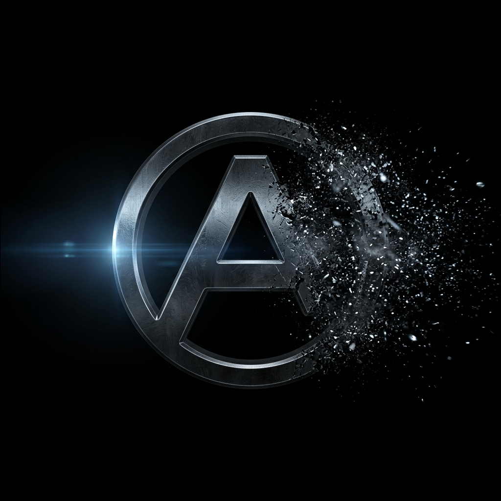
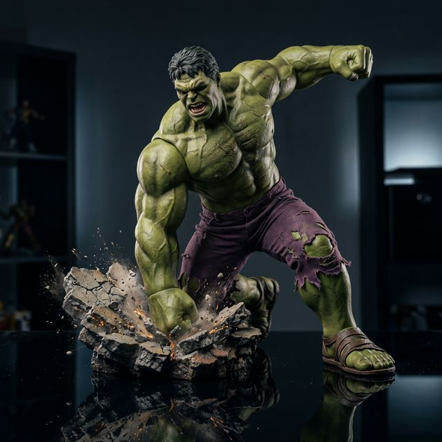
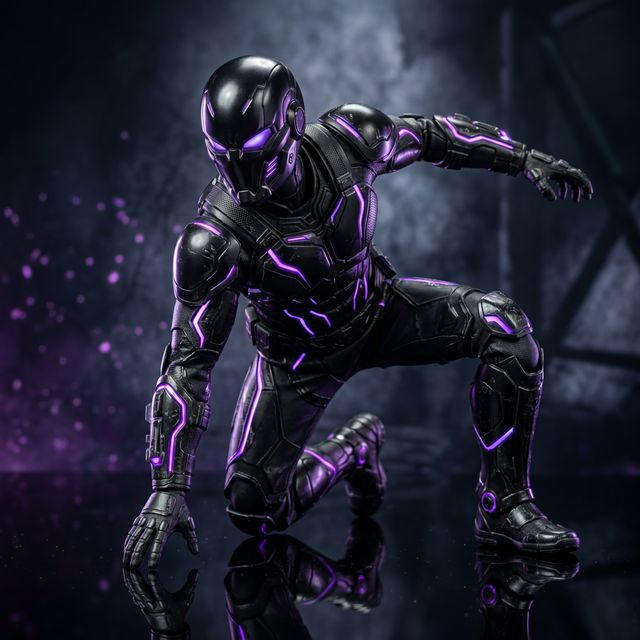
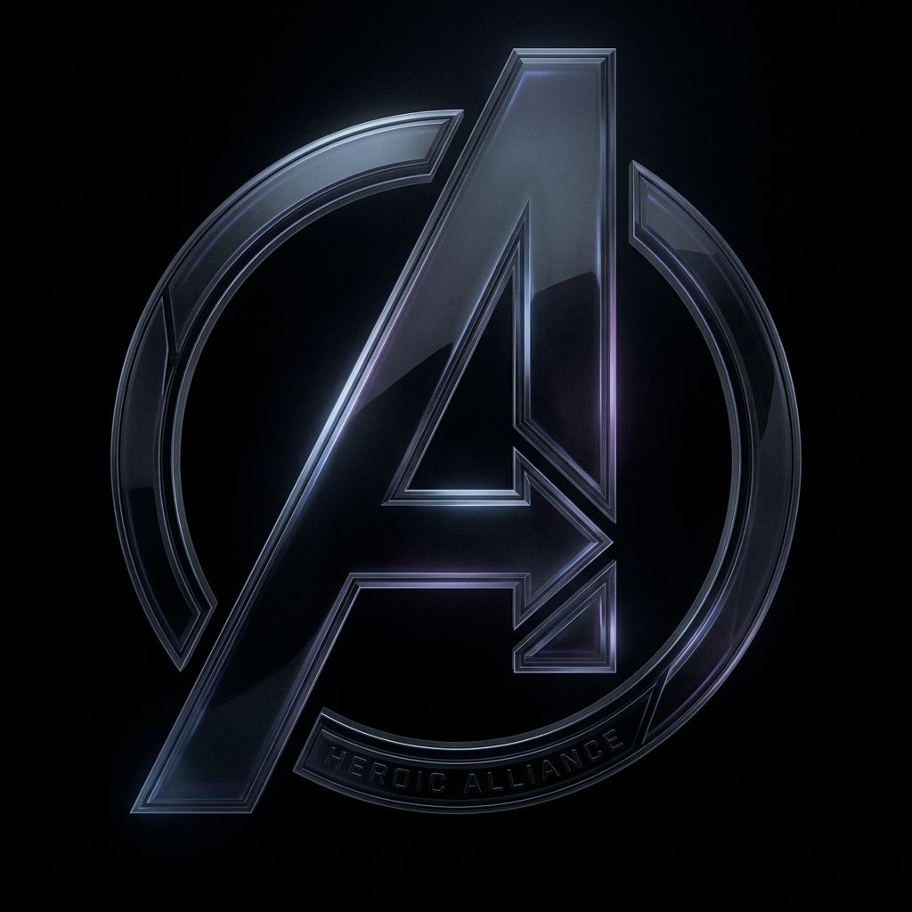

<div align="center">
  

  # ⚡ MARVEL VAULT

  > Premium Marvel Studios Collectible Figures & Toys — A futuristic, cinematic landing page experience.

  [](https://developer.mozilla.org/en-US/docs/Web/HTML)
  [](https://developer.mozilla.org/en-US/docs/Web/CSS)
  [](https://developer.mozilla.org/en-US/docs/Web/JavaScript)
  [](https://vitejs.dev/)

</div>

---

## 🌐 Live Demo

👉 [https://kanishknegi2006-oss.github.io/marvel-site/](https://kanishknegi2006-oss.github.io/marvel-site/)

---

## 🖼️ Preview

<div align="center">
  
  <br/><br/>
  
  <br/><br/>
  
</div>

---

## 🦸 Character Assets

<div align="center">
  <table>
    <tr>
      <td align="center">
        <br/>
        <b>Iron Man</b>
      </td>
      <td align="center">
        <br/>
        <b>Spider-Man</b>
      </td>
      <td align="center">
        <br/>
        <b>Thor</b>
      </td>
      <td align="center">
        <br/>
        <b>Hulk</b>
      </td>
    </tr>
    <tr>
      <td align="center">
        <br/>
        <b>Captain America</b>
      </td>
      <td align="center">
        <br/>
        <b>Black Panther</b>
      </td>
      <td align="center">
        <br/>
        <b>Doctor Strange</b>
      </td>
      <td align="center">
        <br/>
        <b>Avengers Logo</b>
      </td>
    </tr>
  </table>
</div>

---

## 🛠 Tech Stack

| Technology | Purpose |
|------------|---------|
| HTML5 | Semantic page structure |
| CSS3 | Custom design system with CSS variables, glassmorphism, animations |
| Vanilla JavaScript (ESM) | Interactive logic, cart, modal, counters |
| Three.js (via CDN) | Liquid/metallic animated hero background |
| Vite | Dev server & build tooling |
| Google Fonts | Orbitron, Rajdhani, Inter typography |

---

## ✨ Features

- 🎬 **Cinematic hero section** with a Three.js liquid metallic background and animated grid overlay
- 🛒 **Dynamic cart counter** — shows badge only when items are added
- 🃏 **Product cards** with 3D tilt effect, glow FX, and animated hover states
- 🦸 **Hero Loadout Modal** — detailed popup for each character with floating animation
- 📜 **Scroll-reveal animations** powered by Intersection Observer
- 📊 **Animated counter stats** (500+ collectibles, 50K+ collectors, 35+ characters)
- 📱 **Fully responsive** — mobile-first design with hamburger navigation
- ♿ **Accessible** — ARIA labels, semantics, `prefers-reduced-motion` support
- 🔍 **SEO optimized** — Open Graph, Twitter Card, and descriptive meta tags
- 🎨 **Dark futuristic theme** — deep navy/black palette with Marvel-red accents

---

## 🚀 How to Run Locally

```bash
# 1. Clone the repository
git clone https://github.com/kanishknegi2006-oss/marvel-site.git
cd marvel-site

# 2. Install dependencies
npm install

# 3. Start the dev server
npm run dev
```

The site will be available at `http://localhost:5173` (or similar Vite port).

---

## 📁 Folder Structure

```
marvel-site/
├── assets/               # Images, logo, and other static assets
│   ├── avengers-logo.png
│   ├── avengers-logo-bg.png
│   ├── hero-banner.png
│   ├── hero-liquid-bg.png
│   ├── hero-loadout-preview.png
│   ├── modal-preview.png
│   ├── iron-man.png
│   ├── spider-man.png
│   ├── thor.png
│   ├── hulk.png
│   ├── captain-america.png
│   ├── black-panther.png
│   └── doctor-strange.png
├── index.html            # Main landing page
├── collection.html       # Collection hub page
├── about-vault.html      # About / Hero Roster page
├── 404.html              # Custom 404 error page
├── styles.css            # Global design system & component styles
├── script.js             # Main JavaScript (ESM)
├── robots.txt            # Search engine crawler instructions
├── package.json          # Project metadata & scripts
└── README.md             # This file
```

---

## 🎖 Credits & License

- **Design & Development:** [Kanishk Negi](https://github.com/kanishknegi2006-oss)
- **Marvel characters and trademarks** are owned by Marvel Entertainment, LLC — used here for educational/portfolio purposes only.
- **Three.js** liquid background via [threejs-components](https://github.com/nicktarnold/threejs-components)
- **Fonts:** [Google Fonts](https://fonts.google.com/) — Orbitron, Rajdhani, Inter

Licensed under the [MIT License](LICENSE).
