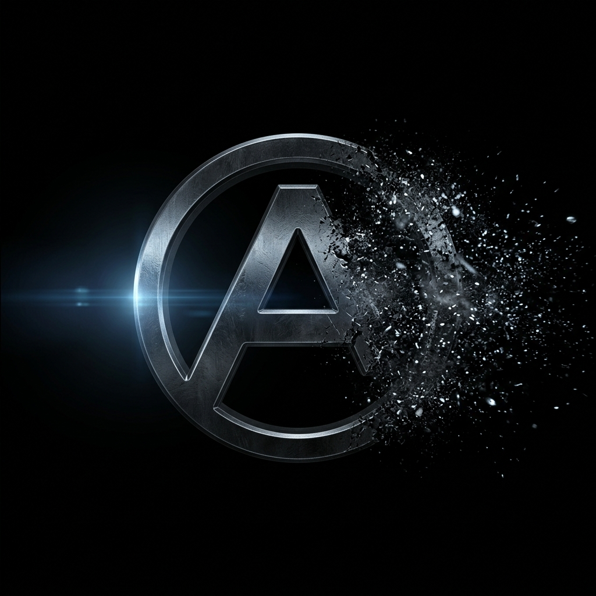
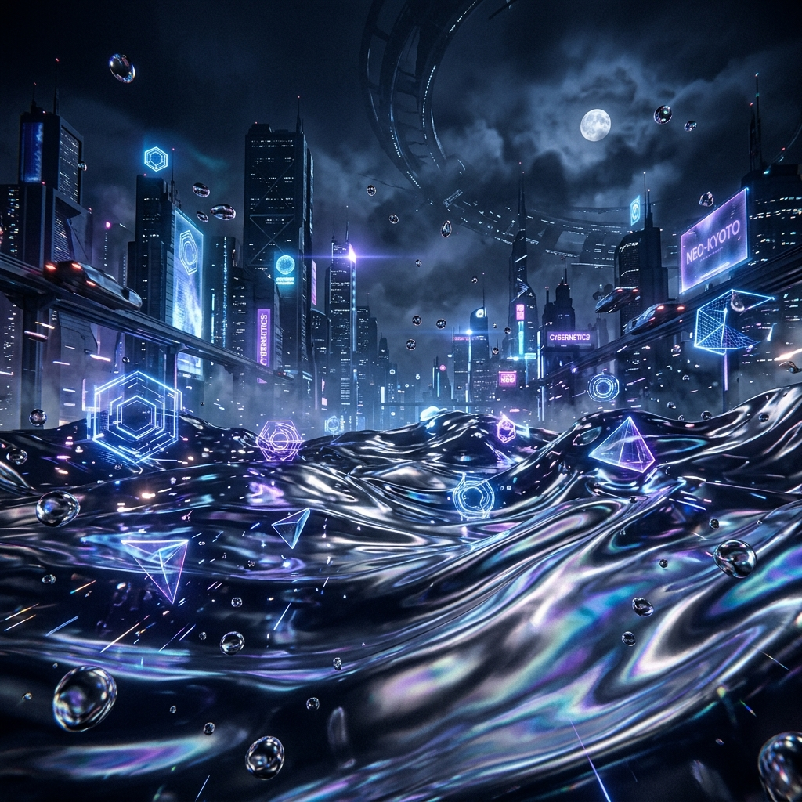
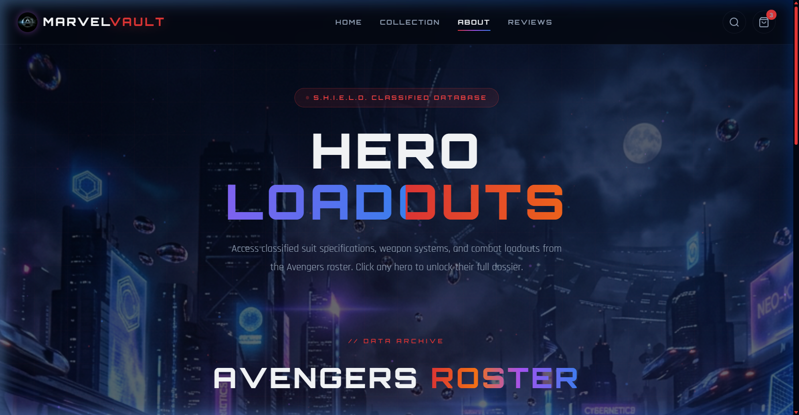
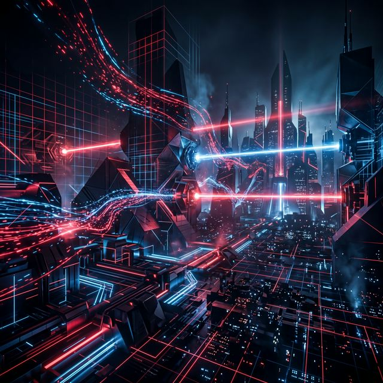
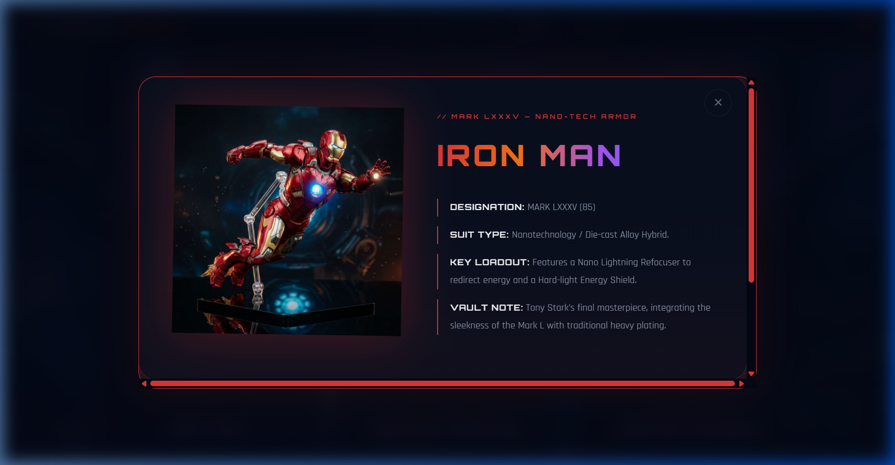

# 🌌 MARVEL VAULT — Tactical Intelligence Archive

<div align="center">
  
  <br>
  <h1>Advanced Digital Archive & Premium Collectibles Hub</h1>
  <p><i>Building the future of Marvel fandom with futuristic UI, glassmorphism, and cinematic aesthetics.</i></p>

  <p>
    
    
    
    
  </p>
</div>

---

## 📽️ Mission Briefing

**MarvelVault** is an elite, immersive web platform designed for high-end collectors and Marvel enthusiasts. Inspired by the tactical interfaces of **Stark Industries** and **S.H.I.E.L.D.**, the archive provides a seamless, cinematic experience for exploring premium collectibles and accessing classified hero dossiers.

### 🌌 The Cinematic Engine (Version 1.2.0 Update)

The platform now features a high-fidelity **Three.js Liquid Background Engine**, replacing static backgrounds with a living, undulating "Neo-Kyoto" chrome surface.

- **Mercury Undulation**: High-metalness liquid shader with recursive displacement for a premium chrome feel.
- **Neon Multiverse Accents**: Dynamic radial gradients layered with a neon grid overlay that pulses in sync with the environment.
- **Glassmorphism Overlay**: backdrop-filter: blur(25px) saturate(200%) logic applied across all tactical cards.

---

## ✨ Tactical Features

### 📂 Classified Hero Vault
- **Dossier System**: High-tech modal popups featuring "scanning" laser animations and tactical specs.
- **Floating Visuals**: 3D-perspective hero images integrated with rotating energy rings.
- **Stark HUD Styling**: Minimalist typography paired with high-contrast neon accents and micro-animations.

### ⚙️ Performance Architecture
- **Vite & ESM Core**: Modern module-based loading for lightning-fast HMR and optimized execution.
- **Mobile-Adaptive HUD**: Fully responsive interface that detects low-power devices and reverts to high-quality static backups.
- **Pure CSS Keyframes**: Optimized 60fps animations for smooth hover and reveal effects.

---

## 🛠️ Technological Stack

| Component | Technical Selection |
| :--- | :--- |
| **Core Engine** | HTML5 Semantic Architecture |
| **Visual Styling** | Modern CSS3 (Custom Design Tokens, HSL Palette) |
| **Logic Engine** | Vanilla JavaScript ES6+ (Module-based) |
| **3D Rendering** | Three.js Liquid Background Component |
| **Build System** | Vite |
| **Typography** | `Orbitron` (HUD), `Rajdhani` (Intel), `Inter` (Body) |

---

## 🚀 Deployment Command Center

Ensure you have **Node.js** installed before initializing the tactical interface.

```bash
# 1. Access the Mission Archive
git clone https://github.com/kanishknegi2006-oss/marvel-site.git

# 2. Enter the Intelligence Directory
cd marvel-site

# 3. Configure Local Dependencies
npm install

# 4. Launch the Tactical Interface
npm run dev
```

The terminal will establish a link at `http://localhost:5173`.

---

## 📂 Intelligence Directory Structure

```text
marvel-site/
├── assets/                 # Augmented multimedia & 8K textures
├── index.html              # Strategic Command Center
├── about-vault.html        # Classified Hero Dossiers
├── script.js               # Tactical Logic & Rendering Engine
├── styles.css              # Stark Industries Design System
└── package.json            # Deployment Protocols
```

---

## 📸 Intelligence Gallery

<div align="center">
  <table width="100%">
    <tr>
      <td align="center"><b>UI: Command Center</b></td>
      <td align="center"><b>UI: The Vault Archive</b></td>
    </tr>
    <tr>
      <td align="center"></td>
      <td align="center"></td>
    </tr>
    <tr>
      <td align="center"><b>FEATURE: Discovery Grid</b></td>
      <td align="center"><b>FEATURE: Tactical Dossiers</b></td>
    </tr>
    <tr>
      <td align="center"></td>
      <td align="center"></td>
    </tr>
  </table>
</div>

---

<div align="center">
  <p>© 2026 MarvelVault Intelligence Bureau. Unauthorized access is strictly prohibited by order of the Sokovia Accords.</p>
  <sub>This project is a high-fidelity tribute to the Marvel Cinematic Universe and its visionary design language.</sub>
</div>
